Outcome Based Course
==========

Requirements
------------


1. Apache2
1. mysql-server
1. python3.7
1. python3-pip
1. python-mysqldb
1. django 3.0
1. libldap2-dev
1. libmysqlclient-dev
1. python3.7-dev

#### Installation

Use the following command to install and setup Outcome Based Course.

```bash
git clone https://github.com/GreatDevelopers/OutcomeBasedCourse
cd OutcomeBasedCourse
```
Creating a python virtual environment 
```bash
sudo pip3 install virtualenv
virtualenv env
source env/bin/activate
```
```bash
sudo apt install apache2 mysql-server python3 python3-pip python3-mysqldb libldap2-dev libmysqlclient-dev python3.7-dev
sudo python3 -m pip install -r requirements.txt
```

Steps for installation of OutcomeBasedCourse:

1. Create a database for OutcomeBasedCourse.

         mysql -u root -p -e "create database outcomebasedcourse;"

1. Edit settings.py file in OutcomeBasedCourse/ directory. Things to be edited are:
   
        DATABASES = {
                 "default":  {
                        "ENGINE": "django.db.backends.mysql",
                        "NAME": "Your database name"
                        "HOST": "Your MySQl server host",
                        "PORT": "Your MySQl server port",
                        "USER": "Your MySQL username",
                        "PASSWORD": "Your MySQl password",
                 } 
         } 

1. Goto the project directory and run the following commands:

        python3 manage.py makemigrations
        python3 manage.py migrate
        python3 manage.py runserver 127.0.0.1:8090

1. Open "http://127.0.0.1:8090" in your browser.


### How it work 

#### Home Page of website

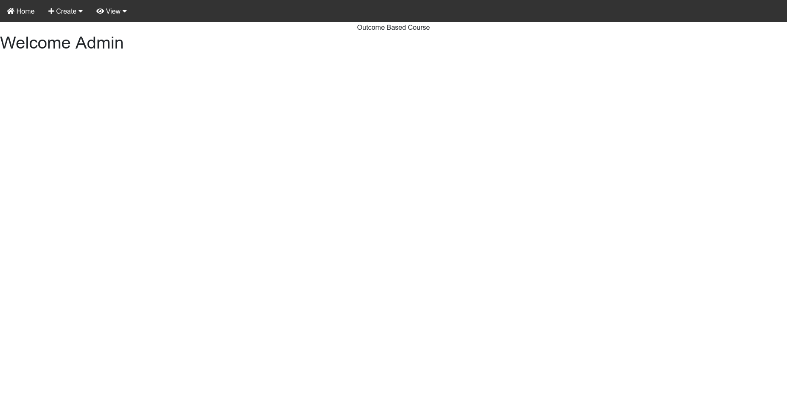

#### Create Superuser in Django
```bash
python manage.py createsuperuser
```
Then enter the Username of your choice and press enter.
```bash
Username: karanjot
```
Then enter the Email address and press enter.(It can be left blank)
```bash
Email address: example@gmail.com
```
Next, enter the Password in-front of the Password field and press enter.Enter a strong password so as to keep it secure.
```bash
Password: ******
```
Then again enter the same Password for confirmation.
```bash
Password(again): ******
```

#### Login

Enter Administrator as the user and password that you set while creating the Superuser.


#### Creating institute

Hava the cursor in create than click institute 
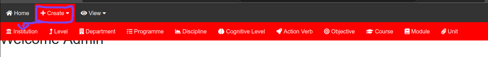

Enter the institute details 


#### Creating Level

Hava the cursor in create than click Level 
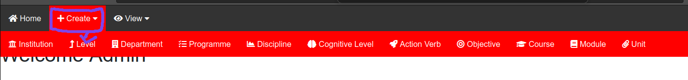

Enter the level details 
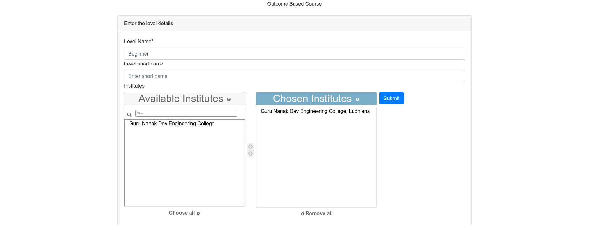

#### Creating Department

Hava the cursor in create than click Department
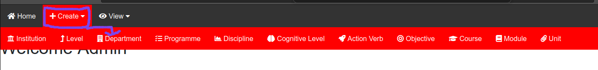

Enter the department details 
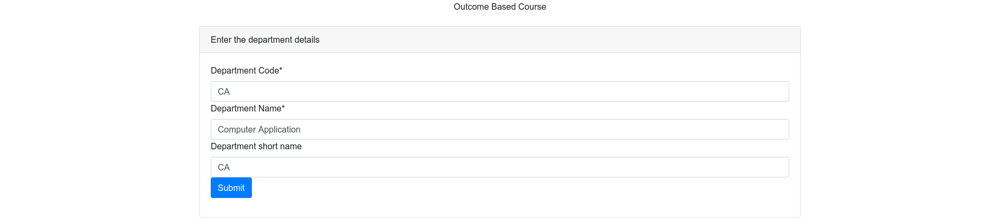

#### Creating Programme

Hava the cursor in create than click programme
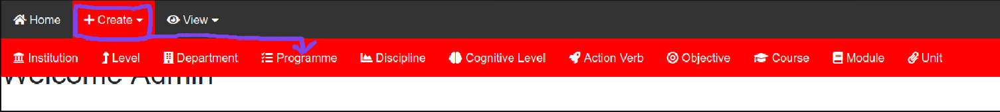


Enter the programme details 
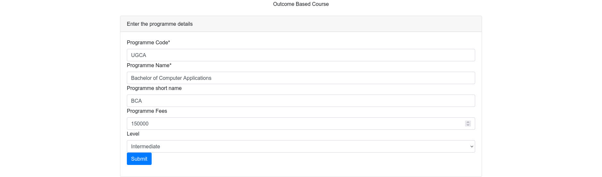

#### Creating Discipline

Hava the cursor in create than click Discipline
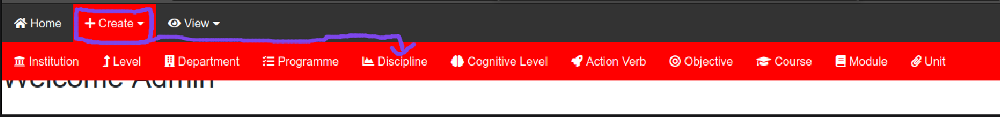

Enter the discipline details 
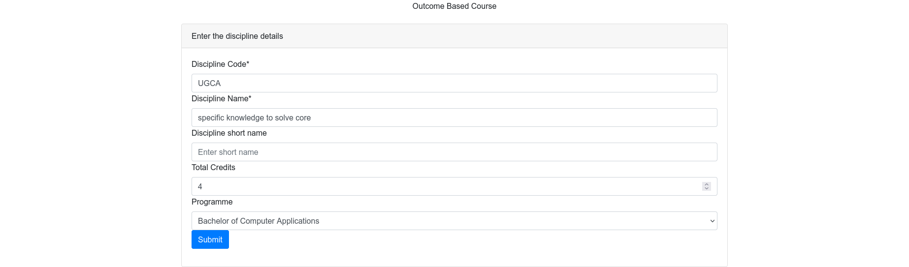

#### Creating Cognitive Level

Hava the cursor in create than click Cognitive Level
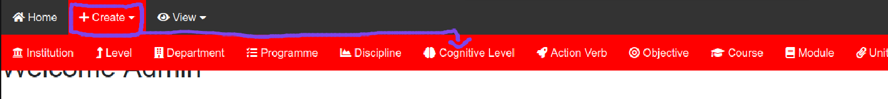

Enter the cognitive level details 
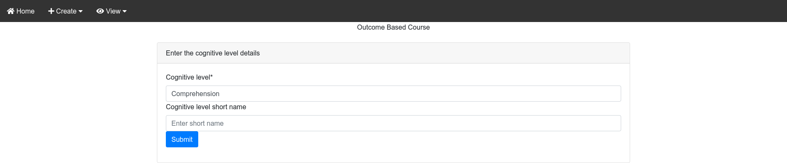

#### Creating Action Verb

Hava the cursor in create than click Action Verb
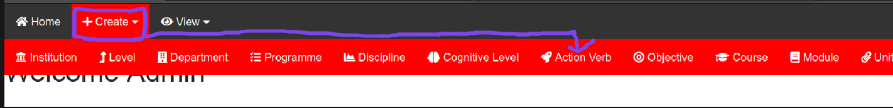

Enter the action verb details 
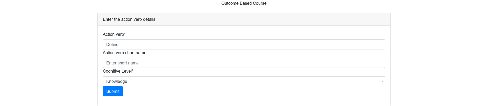

#### Creating Objective

Hava the cursor in create than click Objective
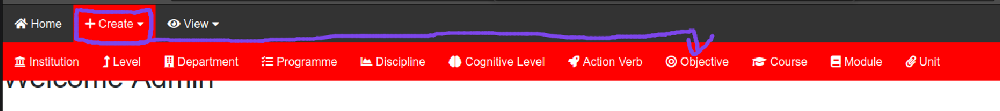

Enter the objective details 


#### Creating Course

Hava the cursor in create than click Course


Enter the course details 
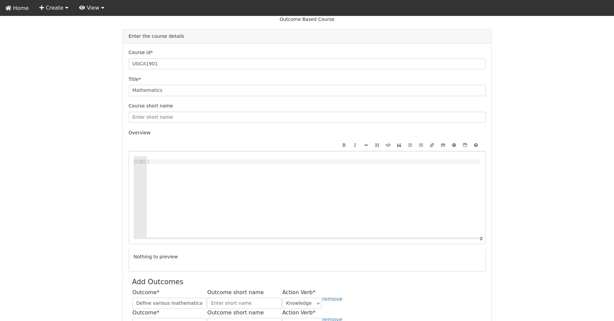

#### Creating Module

Hava the cursor in create than click Module


Enter the module details 
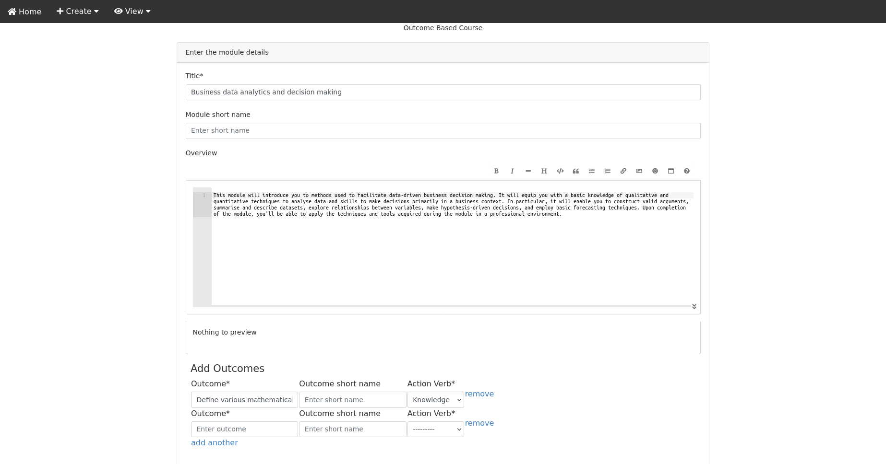

#### Creating Unit

Hava the cursor in create than click Unit
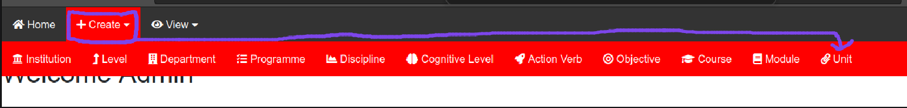

Enter the unit details 
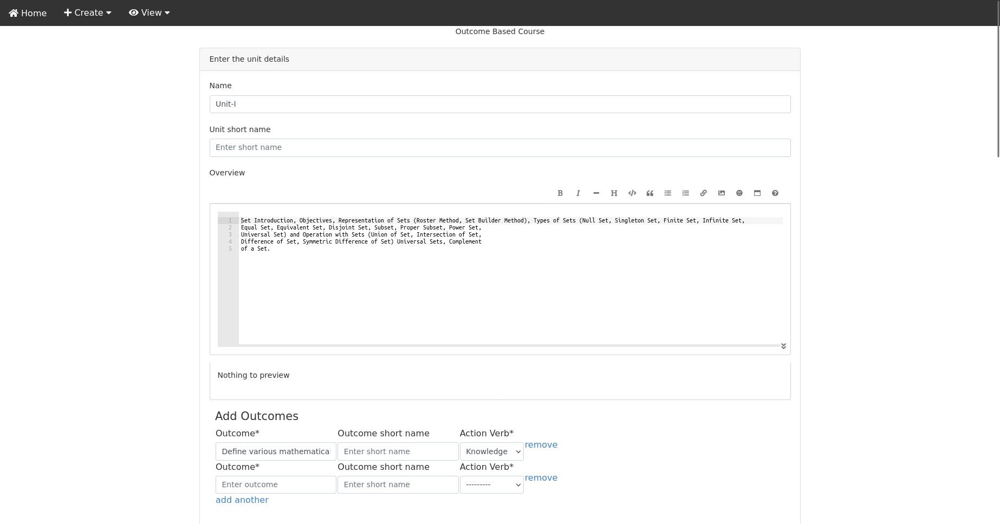


