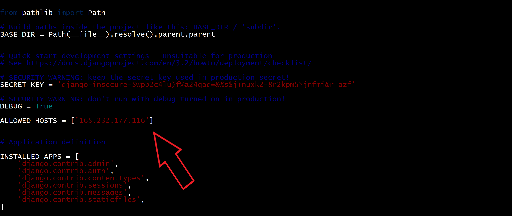

# How to host Outcome Based Course using gunicorn & nginx in Production

Django is a very powerful web framework and ships with a server which is able to facilitate development. This development server is not scalable and is not suited for production. Hence we need to configure gunicorn to get better scalability and nginx can be used as a reverse proxy and as a web server to serve static files. Let's get started 


### Step 1 - Clone the Repository
```bash
git clone https://github.com/GreatDevelopers/OutcomeBasedCourse
cd OutcomeBasedCourse
```
### Step 2 - Installation of all the Requiements
```bash
sudo apt install nginx mysql-server python3 python3-pip python3-mysqldb libldap2-dev libmysqlclient-dev python3.10-dev
sudo pip3 install virtualenv
virtualenv env
source env/bin/activate
pip install -r requirements.txt
pip install django gunicorn
```
### Step 3 - Create a database for OutcomeBasedCourse.
```bash
mysql -u root -p -e "create database outcomebasedcourse;"
```
1. Edit settings.py file in OutcomeBasedCourse/ directory. Things to be edited are:
   
        DATABASES = {
                 "default":  {
                        "ENGINE": "django.db.backends.mysql",
                        "NAME": "Your database name"
                        "HOST": "Your MySQl server host",
                        "PORT": "Your MySQl server port",
                        "USER": "Your MySQL username",
                        "PASSWORD": "Your MySQl password",
                 } 
         } 

1. Goto the project directory and run the following commands:
```bash
        ~/OutcomeBasedCourse/manage.py makemigrations
        ~/OutcomeBasedCourse/manage.py migrate
        ~/OutcomeBasedCourse/manage.py runserver 0.0.0.0:8000
```
1. Open "http://0.0.0.0:8000" in your browser.

### Step 4 - Configuring gunicorn
Add your IP address or domain to the ALLOWED_HOSTS variable in settings.py.

```bash

```
Lets test gunicorn's ability to serve our application by firing the following commands:
```bash
gunicorn --bind 0.0.0.0:8000 OutcomeBasedCourse.wsgi
```


Deactivate the virtualenvironment by executing the command below:
```bash
deactivate
```
Let's create a system socket file for gunicorn now:
```bash
sudo nano /etc/systemd/system/gunicorn.socket
```
Paste the contents below and save the file
```bash
[Unit]
Description=gunicorn socket

[Socket]
ListenStream=/run/gunicorn.sock

[Install]
WantedBy=sockets.target
```
Next, we will create a service file for gunicorn
```bash
sudo nano /etc/systemd/system/gunicorn.service
```
Paste the contents below inside this file:
```bash
[Unit]
Description=gunicorn daemon
Requires=gunicorn.socket
After=network.target

[Service]
User=karanjot786
Group=www-data
WorkingDirectory=/home/karanjot786/OutcomeBasedCourse
ExecStart=/home/karanjot786/OutcomeBasedCourse/env/bin/gunicorn \
          --access-logfile - \
          --workers 3 \
          --bind unix:/run/gunicorn.sock \
          OutcomeBasedCourse.wsgi:application
Restart=always
RestartSec=3
[Install]
WantedBy=multi-user.target
```
Lets now start and enable the gunicorn socket
```bash
sudo systemctl start gunicorn.socket
sudo systemctl enable gunicorn.socket
```
### Step 5 - Configuring Nginx as a reverse proxy
Create a configuration file for Nginx using the following command:
```bash
sudo nano /etc/nginx/sites-available/OutcomeBasedCourse
```
Paste the below contents inside the file created:
```bash
server {
    listen 80;
    server_name gne2.gndec.ac.in;

    location = /favicon.ico { access_log off; log_not_found off; }
    location /static/ {
        root /home/karanjot786/OutcomeBasedCourse;
    }

    location / {
        include proxy_params;
        proxy_pass http://unix:/run/gunicorn.sock;
    }
}
```

Activate the configuration using the following command:
```bash
sudo ln -s /etc/nginx/sites-available/OutcomeBasedCourse /etc/nginx/sites-enabled/
```

Restart nginx and allow the changes to take place.
```bash
sudo systemctl restart nginx
```