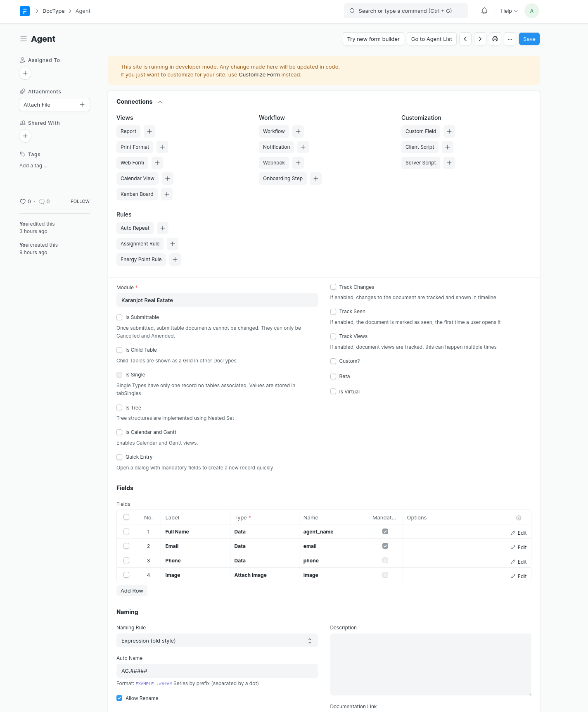
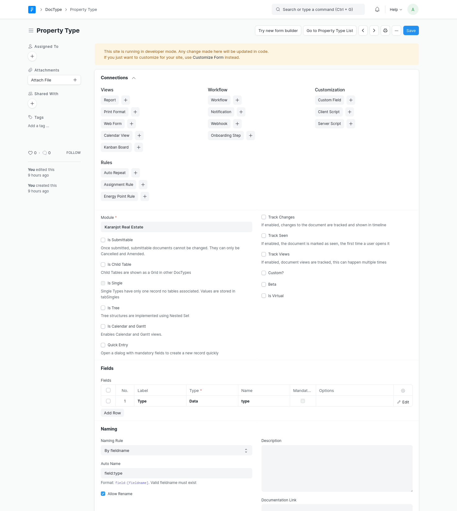
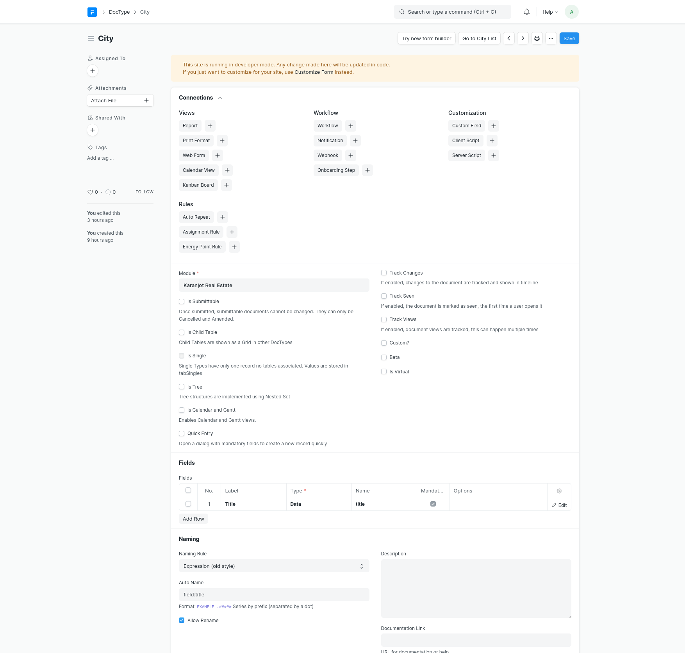
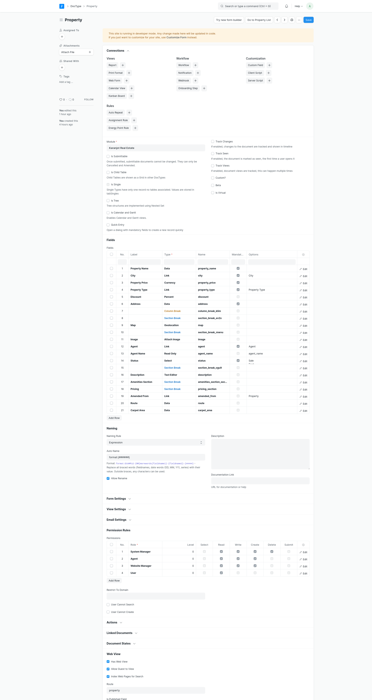
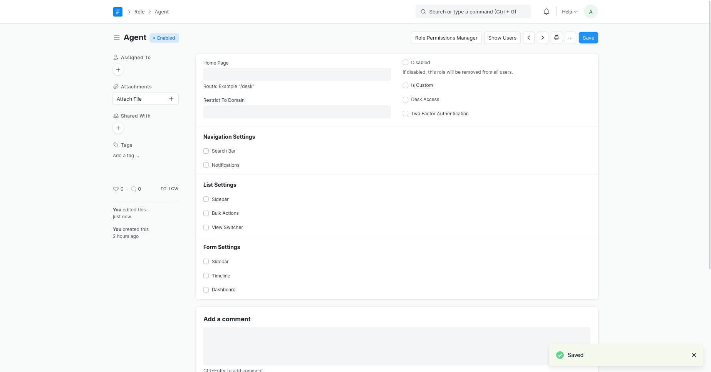
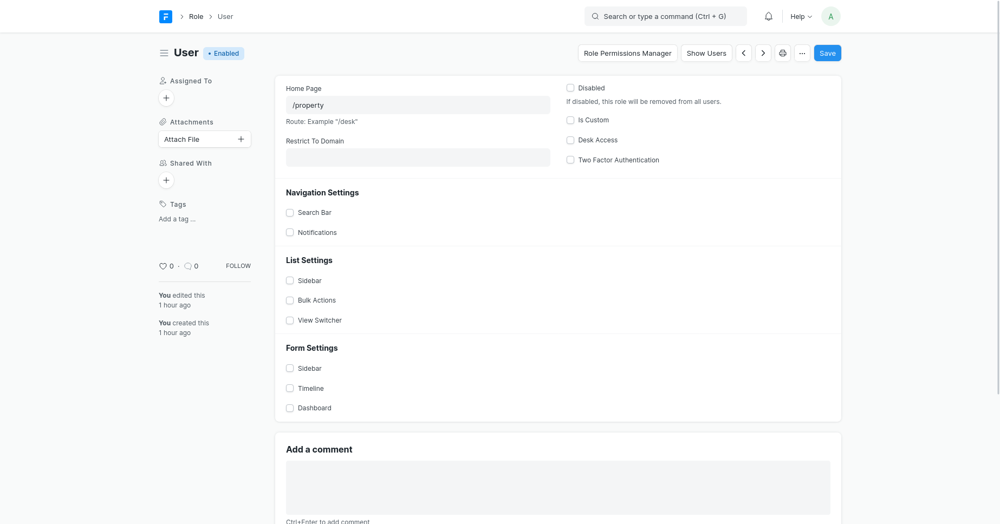
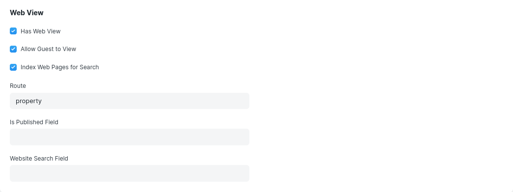
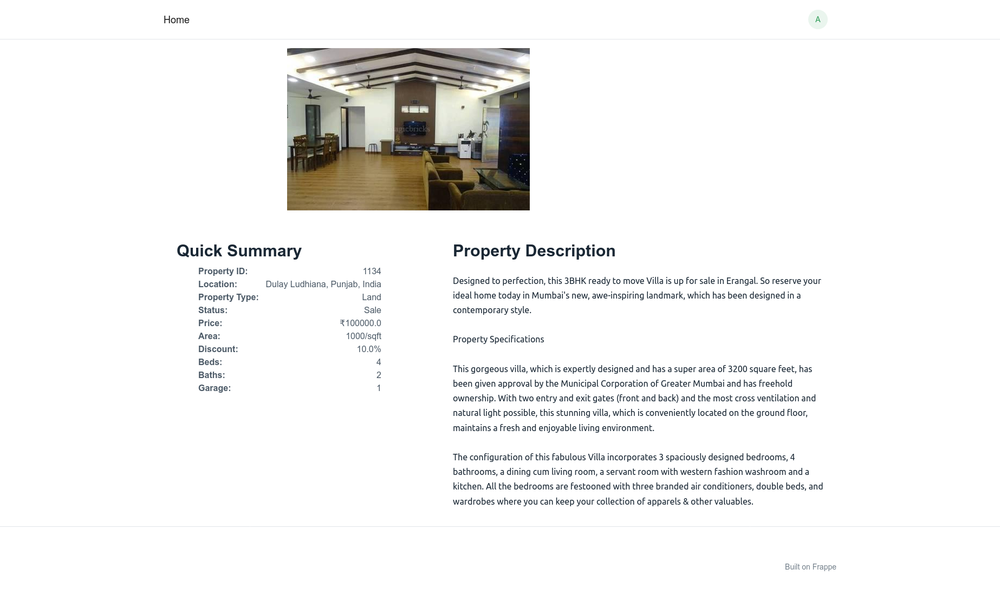
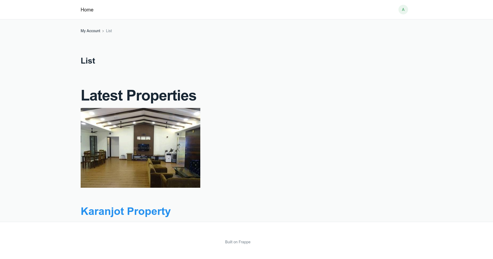

# Jinja and Frappe

## Index
1. [Installation](#installation)
1. [Start bench server](#start-bench-server)
1. [Create app](#create-app)
1. [Create a new site](#create-a-new-site)
1. [Access Sites in you browser](#access-sites-in-you-browser)
1. [Install App on Site](#install-app-on-site)
1. [Login into desk](#login-into-desk)
1. [Creating a DocType](#creating-a-doctype)
    - [Agent](#agent)
    - [Property Type](#property-type)
    - [City](#city)
    - [Property](#property)
1. [Role](#role)
1. [Portal Pages](#portal-pages)
1. [Customize Web View Template](#customize-web-view-template)
1. [Jinja](#jinja)
1. [QnA](#questions-and-answers)


## Installation
First you need to be install Frappe use this script
```bash
git clone https://github.com/Karanjot786/install_frappe
cd install_frappe
chmod u+r+x v14script.sh
./v14script.sh
```
**or**

If you are already install the frappe. Let’s create our project folder which will contain our apps and sites. Run the following command:
```bash
bench init frappe-bench
```

## Start bench server

Now that we have created our frappe-bench directory, we can start the Frappe web server by running the following command:

```bash
cd frappe_v14
bench start
```

## Create app

To create our Library Management app, run the following command from the frappe-bench directory:

```bash
bench new-app karanjot_real_estate
```

## Create a new site

To create a new site, run the following command from the frappe-bench directory:

```bash
bench new-site karanjotrealestate.com
```

## Access Sites in you browser

This will map library.test to localhost. Bench has a convenient command to do just that.

```bash
bench --site karanjotrealestate.com add-to-hosts
```

## Install App on Site

To install our Library Management app on our site, run the following command:

```bash
$ bench --site karanjotrealestate.com install-app karanjot_real_estate

Installing karanjot_real_estate...
Updating Dashboard for karanjot_real_estate
```

## Login into desk

To create DocTypes in our app, we must log in to Desk. Go to ` http://karanjotrealestate.com:8000` and it should show you a login page.


Enter Administrator as the user and password that you set while creating the site.

After successful login, you will see the setup wizard. This is a one-time setup wizard used to set up the site. Go ahead, select your country and complete the wizard.

You should see the Desk that looks something like this:


Good job making it this far!

## Creating a DocType

While in Desk, type 'doctype' in the search bar and select the **DocType List** option. You will be navigated to the DocType list where you will see a bunch of DocTypes. These are the DocTypes that are bundled with the framework.

### Agent
 To create it, click on New.

- Enter Name as Agent
- Select Karanjot Real Estate in Module
- Add the following fields in the Fields table:
  - Agent Name (Data)
  - Email (Data)
  - Phone (Data)
  - Image (Attach Image)

  After adding the fields, click on Save.

  

You will see a Go to Agent List button at the top right of the form. Click on it to go to the Agent List. Here you will see a blank list with no records because the table has no records.


### Property Type
 To create it, click on New.

 - Enter Name as Property Type
- Select Karanjot Real Estate in Module
- Add the following fields in the Fields table:
  - Type (Data)

  After adding the fields, click on Save.

  

You will see a Go to Property Type List button at the top right of the form. Click on it to go to the Property Type List. Here you will see a blank list with no records because the table has no records.

### City
 To create it, click on New.

 - Enter Name as City
- Select Karanjot Real Estate in Module
- Add the following fields in the Fields table:

  - Type (Data)

  After adding the fields, click on Save.

  

You will see a Go to City List button at the top right of the form. Click on it to go to the City List. Here you will see a blank list with no records because the table has no records.

### Property
 To create it, click on New.

 - Enter Name as Property
- Select Karanjot Real Estate in Module
- Add the following fields in the Fields table:
  - Property Name (Data)
  - City (Link)
  - Property Price (Currency)
  - Property Type (Link)
  - Discount (Percent)
  - Address (Data)
  - Map (Geolocation)
  - Image (Attach Image)
  - Agent (Link)
  - Status (Select) Sale, Rent, Lease
  - Description (Text Editor)
  - Amenities Section (Section Break)
  - Pricing (Section Break)
  - Carpet Area (Data)
  - Route (Data)

  After adding the fields, click on Save.

  

You will see a Go to Property List button at the top right of the form. Click on it to go to the Property List. Here you will see a blank list with no records because the table has no records.

## Role

We can create the two different roles in the website
First role is Agent 
  


 the second role is user
  

## Portal Pages

Portal pages are server rendered pages for your website visitors.

We have been exclusively working with the Desk which is the admin interface accessible by System Users. Usually you will want to give limited access to your customers. In our case, we want Library Members to be able to view available Articles that they can issue from our website. Portal Pages can help us achieve that.

Go to Article doctype, and scroll down to the Web View section.

Enable Has Web View and Allow Guest to View
Enter articles in the Route field
Add a field named Route in the fields table
Click on Save
  

## Customize Web View Template

The default web view that is generated is pretty barebones and serves only as a starting point for us to customize it. When we made Article a web view, two HTML files were created namely: `property.html` and article_row.html

Let's edit `property.html` first. Frappe uses Bootstrap 4 by default for it's web views. So, you can use any valid Bootstrap 4 markup to style your pages. Add the following HTML to `property.html`.



```HTML



<section class="property-single nav-arrow-b">
    <div class="container">
      <div class="row justify-content-center">
        <div class="col-lg-8">
          <div id="property-single-carousel" class="swiper">
            <div class="swiper-wrapper">
              <div class="carousel-item-b swiper-slide">
                
              </div>
            </div>
          </div>
          <div class="property-single-carousel-pagination carousel-pagination"></div>
        </div>
      </div>

      <div class="row">
        <div class="col-sm-12">

          <div class="row justify-content-between">
            <div class="col-md-5 col-lg-4">
              <div class="property-summary">
                <div class="row">
                  <div class="col-sm-12">
                    <div class="title-box-d section-t4">
                      <h3 class="title-d">Quick Summary</h3>
                    </div>
                  </div>
                </div>
                <div class="summary-list">
                  <ul class="list">
                    <li class="d-flex justify-content-between">
                      <strong>Property ID:</strong>
                      <span>1134</span>
                    </li>
                    <li class="d-flex justify-content-between">
                      <strong>Location:</strong>
                      <span>{{address}}</span>
                    </li>
                    <li class="d-flex justify-content-between">
                      <strong>Property Type:</strong>
                      <span>{{property_type}}</span>
                    </li>
                    <li class="d-flex justify-content-between">
                      <strong>Status:</strong>

                        
                        <span>Rent</span>
                        
                        <span>Lease</span>
                        
                        <span>Sale</span>
                        
                    </li>
                    <li class="d-flex justify-content-between">
                      <strong>Price:</strong>
                      <span>₹{{property_price}}
                      </span>
                    </li>
                    <li class="d-flex justify-content-between">
                        <strong>Area:</strong>
                        <span>{{carpet_area}}
                        </span>
                      </li>
                    <li class="d-flex justify-content-between">
                        <strong>Discount:</strong>
                        <span>{{discount}}%</span>
                      </li>
                    <li class="d-flex justify-content-between">
                      <strong>Beds:</strong>
                      <span>4</span>
                    </li>
                    <li class="d-flex justify-content-between">
                      <strong>Baths:</strong>
                      <span>2</span>
                    </li>
                    <li class="d-flex justify-content-between">
                      <strong>Garage:</strong>
                      <span>1</span>
                    </li>
                    
                  </ul>
                </div>
              </div>
            </div>
            <div class="col-md-7 col-lg-7 section-md-t3">
              <div class="row">
                <div class="col-sm-12">
                  <div class="title-box-d">
                    <h3 class="title-d">Property Description</h3>
                  </div>
                </div>
              </div>
              <div class="property-description">
                <p class="description color-text-a">
                    {{ description }}

                </p>
              </div>

            </div>
          </div>
        </div>
      </div>
    </div>
</section>

```


Now, go to any Article and click on See on Website. If you have filled in all fields of your Article, you should see a page like this:



Now, open http://library.test:8000/property. This should show the list of articles, but it is also pretty barebones. Let's customize the HTML.

Edit the article_row.html and add the following HTML:



```HTML
<h1>Latest Properties</h1>
<div id="property-carousel" class="swiper">
	<div class="swiper-wrapper">

	  <div class="carousel-item-b swiper-slide">
		<div class="card-box-a card-shadow">
		  <div class="img-box-a">
			
		  </div>
		  <div class="card-overlay">
			<div class="card-overlay-a-content">
			  <div class="card-header-a">
				<h2 class="card-title-a">
				  <a href='{{ doc.route }}'>{{ doc.property_name }}
				</h2>
			  </div>

			</div>
		  </div>
		</div>
	  </div>
	</div>
</div>
```


Now, the articles list should look prettier. You can click on any article to view it's details.



## Jinja 
Frappe is a web framework that uses Jinja2 templating engine. Here are some basic components of Jinja that are commonly used in Frappe:

**Variables:** You can use variables in your templates to display dynamic content. In Frappe, variables are enclosed in double curly braces, like this: **{{ variable_name }}**.

**Control Structures:** Control structures, such as if statements and loops, are used to conditionally display or iterate over content. In Frappe, control structures are enclosed in **** tags, like this: ** ... .**

**Template Inheritance:** Frappe, like other web frameworks, allows you to define base templates that can be extended by child templates. The **** statement is used to inherit from the base template.


## Questions and Answers

**What is Jinja?**
***
Jinja is a template engine for Python, which allows developers to create dynamic HTML by using placeholders and logic statements in a template file. It is commonly used in web development frameworks like Flask and Django to separate presentation logic from the application code. Essentially, Jinja helps simplify the process of generating dynamic content for web applications.

**what is Jinja Templates**
***
Jinja Templates are files that contain a mixture of static text and dynamic content, which are processed by the Jinja template engine to produce dynamic output.